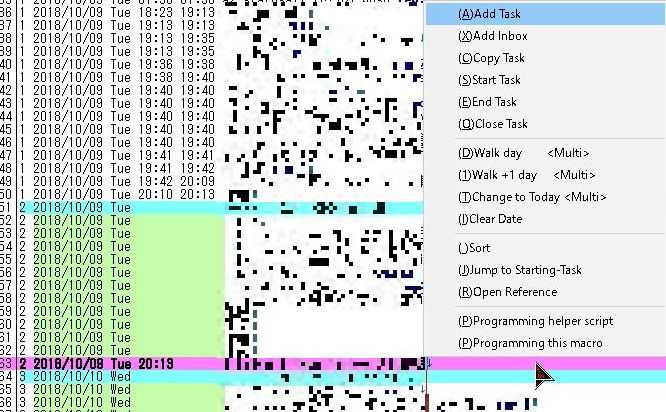

# Tritask のコンセプト
タスク管理ツール Tritask のコンセプトについて。

## Tritask とは
Tritask は秀丸エディタ上で動作する行指向のタスク管理ツールです。煩雑な画面遷移や入力フォームに煩わされることなく、慣れ親しんだエディタ上でタスク管理を行うことができます。

## はじめに
Tritask のコンセプト紹介ですが、「システムコンセプト」「データコンセプト」「操作コンセプト」に分けて紹介していきます。

システムコンセプトでは、Tritask が考える「タスク管理」について述べます。タスク管理とは、たとえるなら「スポーツ」という言葉と同じで、非常に曖昧な言葉です。野球かもしれないし、サッカーかもしれないし、陸上競技かもしれないのです。タスク管理とはどんな事を指しているのか、を事前にはっきりさせておく必要があります。

データコンセプトでは、Tritask が扱うデータについてのコンセプトを述べます。

操作コンセプトでは、Tritask の基本操作および操作フローについて述べます。

## システムコンセプト

### タスクはプログラミングや執筆のように「頻繁に編集する」もの
私達は多数のタスクに囲まれて生きています。仕事をブレイクダウンすると何十というサブタスクが生じますし、変化の激しい昨今、新たなタスクが次々に発生することも珍しくありません。また、やりたいことが多い方は、タスクという名のアイデアがどんどん湧いていることでしょう。

これらを扱うのに、従来の画面ベースのツールでは力不足です。タスク一件を編集するのに、いちいち画面遷移をして、煩雑な入力フォームに入力して……そういったことができますか？私には無理です。ストレスで死んでしまいます。

Tritask は違います。タスクをテキストエディタ上で編集します。テキストを書くように、タスクを書くことができます。もちろんタスク管理に必要な仕組みやコンセプトは（フリーな編集を損なわないように注意深く）盛り込んでおり、また操作も極力自動化しています。

プログラミングのように。あるいは執筆のように。タスクをガシガシ編集しましょう。

### デイリータスクリスト
「今日行うタスク」を集めたリストを **デイリータスクリスト** と呼びます。この考え方は「今日やること」と「明日以降でもできること」の区別を支援します。

Tritask では「明日以降でもできること」を「今日やること（デイリータスク）」から切り離して配置します。これにより、今日やることだけに集中できます。 **明日以降やることは明日になった時に表示されるため忘れる心配はありません**。明日以降でもできることはどんどん明日以降に回し、今日は今日やることに集中する――それが Tritask の目指すスタイルです。

### ルーチンタスク
n日毎に毎回行うタスクを **ルーチンタスク** と呼びます。仕事にせよ生活にせよ、人は数十のルーチンタスクを抱えているのが一般的です。以下にいくつか例を挙げます。

- 日用品や食料品を買い足す
- 床やトイレを掃除する
- 薬を飲む
- 勤怠状況を入力する（システムにログインする、タイムカードを切る等）
- データのバックアップを取る
- 机の上を片付けて引き出しを施錠する
- ……

Tritask ではルーチンタスクを簡単に定義できます。たとえば毎日繰り返すタスクなら、タスク内容に「rep:1」と書くだけです。

Tritask の優れているところは、タスクを完了した後も **n日後のタスクとして自動的に再設定してくれる** ことです。再設定の手間や漏れがありません。

この仕組みのおかげで、一日何十というルーチンタスクを扱うことも苦ではありません。実際、作者である私は仕事でもプライベートでも、毎日 20-30 のルーチンタスクを消化しています。タスクのし忘れからも解放され、日々快適に過ごしています。

### 実行日の簡単指定
各タスクは **実行日（そのタスクをいつ実行するのか）パラメーター** を持っていますが、Tritask ではこれを簡単に編集できます。

- 例1: 「2018/10/09 に実行する！」のように日付を決め打ちで指定する
- 例2: 「今の実行日から三日後に実行する」のように相対的な日数を指定する
  - n日後だけでなくn日前も指定できます

つまり絶対指定と相対指定の両方に対応しています。もちろん操作はショートカットキーから簡単に呼び出せます。

これにより、たとえば以下のような作業を簡単に行うことができます。

- 例1: このタスクは明日でいいから明日に回そう
- 例2: このタスクは 2018/10/09 に行うものだから 2018/10/09 のタスクとして配置しておこう
- 例3: このタスク、明後日やろうと思って明後日に回したけど、今日時間が余ったので今日やろう

タスクの実行日を自在に振り分ける、この快適さをぜひ味わってください。

### 見やすい並び替え
タスク管理においてしばしば問題となるのが、タスクをどのように並べて表示するかという悩み、あるいはそのような作業に要する手間です。

Tritask ではシンプルなルールを採用しています。二点あります。

一点目。「今日やるタスク」の塊、**「明日以降やるタスク」の塊、「昨日以前にやったタスク」の塊、をこの順で上から表示** します。この並び順は、最も重要な「今日やるタスク」を一番上に、次に重要な「明日以降やるタスク」を二番目に、そして振り返り時にしか使わない、普段は用のない「昨日以前にやったタスク」は三番目に……という考え方に従っています。

二点目。各塊の各タスク（行）は **行毎に昇順（辞書順）で並び替えられます**。逆を言うと、それだけです。この仕様により、終了させたタスクは「先に終わらせた順」にキレイに並びます。また、まだ開始していないタスクを意図的に並び替えたい場合は、辞書順を意識すれば可能です。たとえば「1 タスク２」は「タスク１」よりも先に表示されます。半角数字の「1」は全角文字の「タ」よりも、昇順で先に並ぶからです。

このような統一的な表示ルールにより、利用者はタスクの表示順について悩まされる問題から解放されます。また表示順の制御にかかる手間も最小限に抑えることができます。つまり、

- 今日やるタスクは今日やるタスクの塊にあるので、そこを見ればいい
  - 明日以降や昨日以前も同様
- 「今日やるタスクの塊」の中は、単に辞書順で並ぶだけなので、表示順を変えたければタスク内容を（辞書順を意識して）工夫するだけでよい

ということです。一見すると難しそうに見えますが、使っていくうちに、これがとても直感的で強力な表示制御システムだと気づくでしょう。

## データコンセプト

### plain text 
Tritask で扱うデータはただのテキストファイルです。

そのため管理、メンテナンスや加工も容易だという特徴があります。また動作も軽く、ストレスを感じません。

### .trita
Tritask のデータファイルの拡張子は .trita です。

独自の拡張子を採用することにより、秀丸エディタにおける「ファイルタイプ別の設定」にて、Tritask 独自の設定を作成することができます。他のファイルタイプと被ることはありません。

### 一行一タスク
Tritask では一行につき一つのタスクを記述します。

つまりタスクの編集とは、タスクを表す行の編集に他なりません。

### シンプルなタスクフォーマット
Tritask が扱うタスクは、とてもシンプルなフォーマットをしています。従来のタスク管理のように、よくわからないパラメーターが何個も何個もあるといったことはありません。

利用者はほぼフリーフォーマットでタスク内容を記述するように、自由に記述できます。Tritask のタスクには日付や時刻を書くフィールドこそありますが、ショートカットキーで一発入力できるので心配は要りません。

## 操作コンセプト

### 直感的な CRUD
タスクの CRUD(Create/Read/Update/Delet) 操作はとても簡単です。ただ行を新たに追加、編集、削除すれば良いだけなのですから。

もちろん、タスクのフォーマット（特に日付や時刻の入力など）に従った入力やカーソル移動などでお手を煩わせないよう、操作の省力化も用意してあります。

### メニューアクセス
Tritask の操作はポップアップメニューから行います。

マウス派の方は、ツールバーに配置してから呼び出せます。しかし Tritask はキーボードの方が素早く操作できるでしょう。

キーボードではショートカットキーにてメニューを開き、さらに文字キーを押すことで項目を選択します。つまり **2ステップキーアクセス** のショートカットキーとなっています。文字キーの対応は直感的につくられており、たとえばタスクの開始は Start を表す S で、タスクの終了は End を表す E です。また、この文字対応はカスタマイズすることもできます。

「2ステップだと遅くないか？1ステップが良いのではないか」と思われるかもしれませんが、2ステップであることには理由があります。以下の二点です。

- メニューを表示するので、慣れないうちも利用しやすい
  - 1ステップだと割り当て設定を見返す or チートシートのようにどこかにまとめておく必要があります
- ショートカットキーとしてはメニューを表示する分の **一つのみを使用する**  ため **キー割り当てを多数侵食しない**

### タイムトラッキング(見積もり)
Tritask では各タスクが「開始時刻」と「終了時刻」を持ちます。

簡単な TODO リストでは、TODO をチェックしたら終わりですが、Tritask では少し手順が増えます。

- 開始時に開始時刻を記入
- 終了時に終了時刻を記入

以上 2 ステップを踏みます。こうすることで、いつ、どのタスクをこなしたのかがすべて記録されます。あとから振り返ったり、集計・分析したりする際にも重宝します。

ここで「時刻記入は面倒くさい」と思われるかもしれませんが、Tritask ではショートカットキーで簡単に入力できます。

### ソート駆動
Tritask では **タスクを編集する → ソートする** というサイクルを繰り返します。プログラミングにおけるビルドだと思ってください。ただしビルドほど時間はかかりません。私の Tritask では一万を超えるタスクを扱っていますが、ソートにかかる時間は1秒未満です。

システムコンセプトで記した通り、Tritask ではタスクの表示順にルールがあります。これを自動的に適用するのがソート操作というわけです。

また、各タスクの属性（たとえば rep:1 と書くルーチンタスクパラメーター）が解釈されるのも、このソートのタイミングです。やり残してしまったタスク（実行日が昨日以前＆まだ終了していないタスク）の実行日を今日に補正するのも、このソートの時です。このように **ソートは各種解釈や補正処理の契機となるタイミング** でもあります。

編集して、適宜ソートする。このサイクルを覚えてください。

## おわりに
以上、Tritask のコンセプトについてまとめてみました。

コンセプトを知っておけば Tritask の理解や利用もスムーズに進みやすいと思います。
