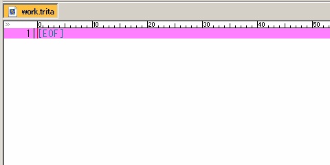
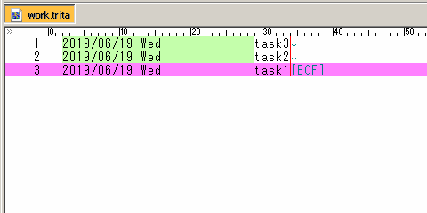
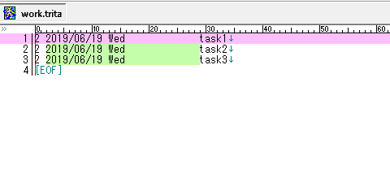
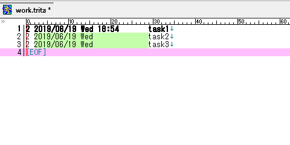
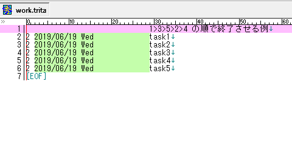
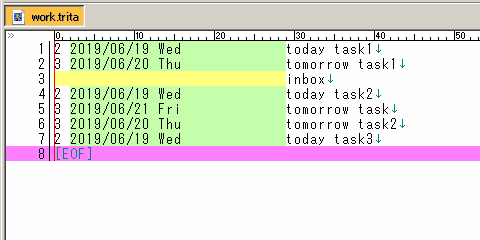
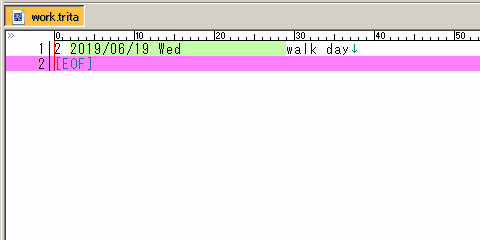
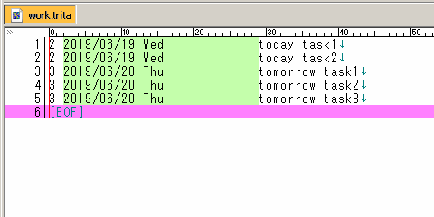
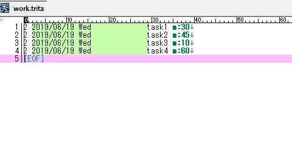

# Tritask GIF ギャラリー
Tritask がどんなものかを知っていただくために GIF 画像を用意してみました。

## 各操作

### Add task
タスクを追加する時に呼び出します。日付時刻部分などを自動で入力するので、手作業で新しく行をつくるよりも速いです。

### Add in-box
Inbox(実行日のないタスク)をつくりたい時はこちらを呼び出します。Inbox は実行日有りのタスクよりも上に表示される性質があり、その名のとおりインボックス(未整理の事柄)として使えます。

### Copy task
既存のタスク行を複製する操作です。何気に多用します。

### Start task
タスクの開始 = 開始時刻の記入です。

### End task
タスクの終了 = 終了時刻の記入です。開始時刻と併せて「いつ始めて、いつ終わったのか」がわかります。

以下は開始と終了を連続して行う例です。

### Sort
Tritask で最も多用するであろうソート処理です。リストをキレイに並べます。

### Walk day
地味に多用する日付操作です。たとえば「このタスクは明日でいいや」とするときに Walk day で 1 足したり、10 日後のタスクに対して「これ 5 日早めるか」としたいなら -5 したりします。

### Walk day +1
Walk day でも 1 を足す(翌日にする)はよく使うので、専用に項目が設けられています。

### Change to today
未来日のタスクを今日のタスクにする時に使います。

### Today report
選択範囲のタスクに対して「計何時間かかるか」「全部終わったら何時何分になる見込みか」をレポートします。事前に m:30 のように見積もり属性の記載が必要です。

ちなみに範囲選択無しで呼び出すと「今日のタスクすべて」に対して実行できます。
