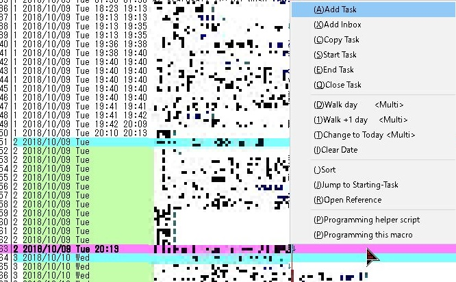

# Tritask
執筆のように。プログラミングのように。テキストエディタでガシガシ編集するストレスフリーなタスク管理。

## 資料
- [Tritask とは](overview.md)
- [Tritask 紹介動画(Youtube)](https://www.youtube.com/watch?v=YwrIr6WNJK0)
- [Tritask のコンセプト](concept.md)
- [Tritask スタートアップガイド](startup_guide.md)
- [GIF ギャラリー](gifs.md)

## ダウンロード
- tritask-sta(秀丸エディタ + Python)
  - [紹介ページ(GitHub)](https://github.com/tritask/tritask-sta)
  - [ダウンロード](https://tritask.github.io/tritask-sta-bin/)
- tritask-vscode(Visual Studio Code + Python)
  - [ダウンロード(GitHub)](https://github.com/tritask/tritask-vscode)

## 開発者向けリンク
- [Tritask エントランス](https://github.com/tritask/tritask)
- 記事(内容が古いことがあります)
  - 18/03/19 [エンジニア向けのタスク管理ツールを作ってみた - Qiita](https://qiita.com/sta/items/2b1248869078ac8032d6)
  - 18/02/27 [エンジニア向けタスク管理ツール Tritask を作った - stamemo](http://stakiran.hatenablog.com/entry/2018/02/27/185034)

## 作者について
- [@stakiran](https://stakiran.github.io/stakiran/)
